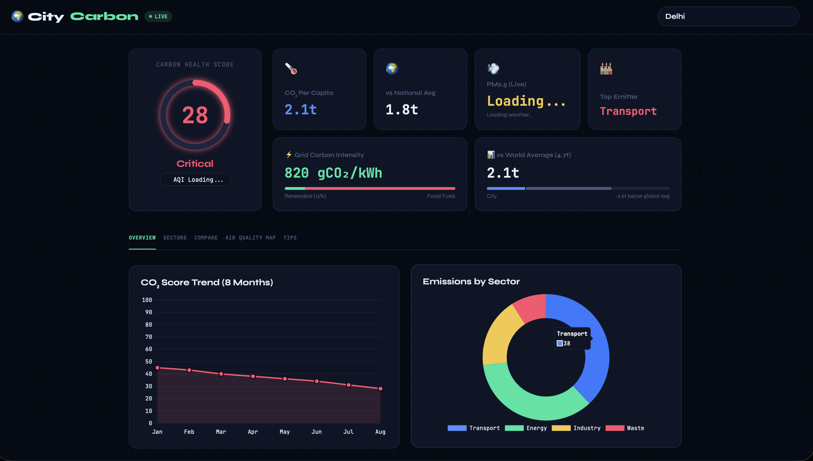
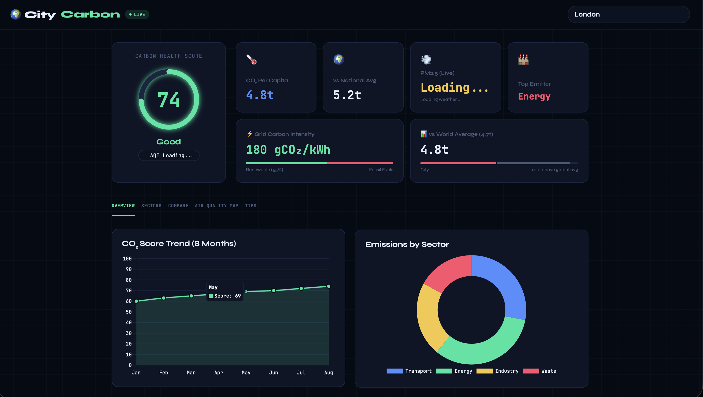
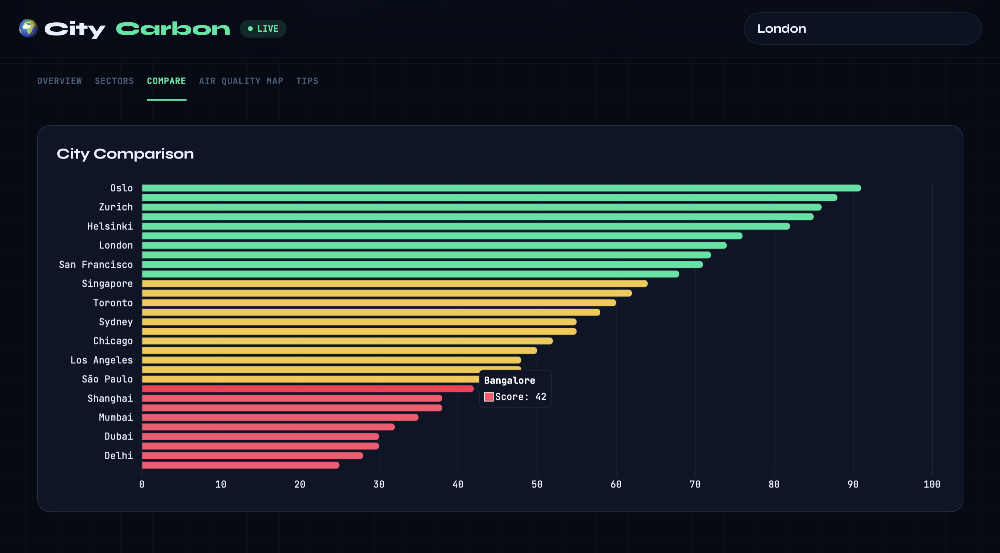
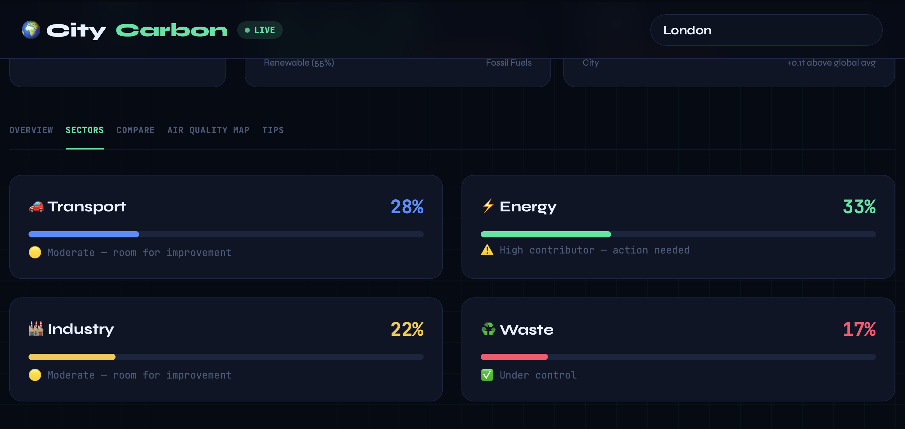
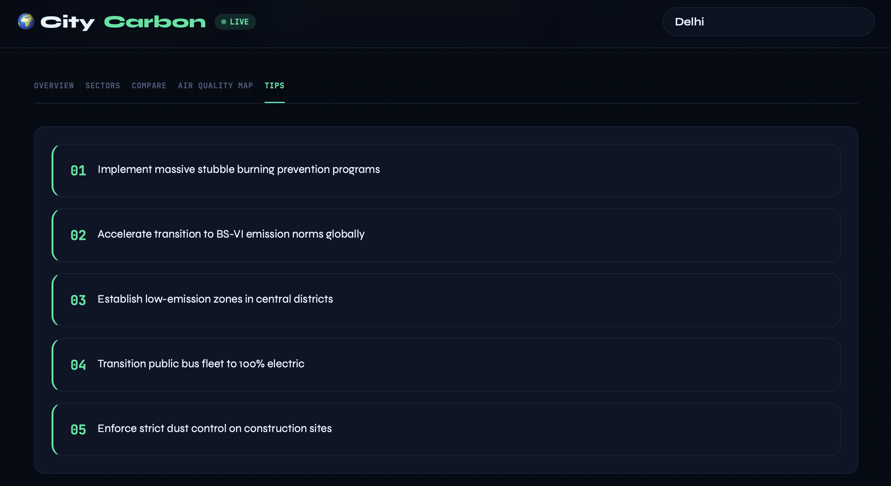

<div align="center">

# 🌍 CityCarbon
### Real-time City Carbon Emission Dashboard

[]()
[]()
[]()
[]()

</div>

---

## 📸 Screenshots

<div align="center">

| Delhi — Critical | London — Good |
|:---:|:---:|
|  |  |

| City Comparison | Emission Sectors | Reduction Tips |
|:---:|:---:|:---:|
|  |  |  |

</div>

---

## ✨ Features

- 🟢 **Live Carbon Health Score** — Color-coded score per city (Critical / Moderate / Good)
- 🏭 **Emissions by Sector** — Transport, Energy, Industry, Waste breakdown with donut chart
- ⚡ **Grid Carbon Intensity** — gCO₂/kWh with Renewable vs Fossil Fuels progress bar
- 🌐 **vs World & National Average** — Instant comparison with global benchmarks
- 📊 **CO₂ Score Trend** — 8-month historical line chart per city
- 🗺️ **Air Quality Map** — Live PM2.5 data overlay
- 🏙️ **City Comparison** — Ranked horizontal bar chart across 16+ global cities
- 💡 **Reduction Tips** — AI-generated city-specific action recommendations
- 🔍 **Search Any City** — Dynamic data load for any global city

---

## 🛠️ Tech Stack

| Layer | Technology |
|-------|-----------|
| Frontend | HTML, CSS, JavaScript |
| Charts | Chart.js |
| Air Quality | WAQI API / OpenAQ API |
| Weather | OpenWeatherMap API |
| Carbon Data | Climate / Emissions Dataset |

---

## 🚀 Setup
```bash
# 1. Clone the repo
git clone https://github.com/yourusername/CityCarbon.git

# 2. Open index.html in browser
# Or use Live Server in VS Code
```

Add your API keys in `config.js`:
```javascript
const CONFIG = {
  WAQI_API_KEY: "YOUR_WAQI_KEY",
  WEATHER_API_KEY: "YOUR_OPENWEATHER_KEY"
}
```

Get free keys at:
- [waqi.info/api](https://aqicn.org/api/)
- [openweathermap.org/api](https://openweathermap.org/api)

---

## 🏙️ Supported Cities

Oslo · Zurich · Helsinki · London · San Francisco · Singapore · Toronto · Sydney · Chicago · Los Angeles · São Paulo · Shanghai · Mumbai · Dubai · Delhi · and more...

---

## 📄 License
MIT License — free to use and modify.

<div align="center">
Made with 💚 for a cleaner planet · ⭐ Star if you care about climate!
</div>
